# Bitcoin Trading System - Database ERD

## Overview
The Bitcoin Trading System uses three SQLite databases to manage different aspects of the application:

1. **api_cache.db** - API response caching
2. **trading_system.db** - Core trading data and analytics
3. **historical_data.db** - Historical market data

## Entity Relationship Diagram

```mermaid
erDiagram
    %% API Cache Database
    api_cache {
        INTEGER id PK
        TEXT cache_key UK
        TEXT data_type
        TEXT api_source
        TEXT response_data
        TEXT response_format
        TIMESTAMP created_at
        TIMESTAMP expires_at
        INTEGER hit_count
        TIMESTAMP last_accessed
        TEXT metadata
    }
    
    cache_invalidation_log {
        INTEGER id PK
        TEXT pattern
        TEXT reason
        TIMESTAMP invalidated_at
        INTEGER entries_affected
    }
    
    cache_stats {
        INTEGER id PK
        DATE date UK
        INTEGER total_hits
        INTEGER total_misses
        INTEGER total_writes
        INTEGER total_invalidations
        INTEGER unique_keys
        INTEGER total_size_bytes
    }
    
    %% Trading System Database
    trades {
        TEXT id PK
        TEXT symbol
        TEXT trade_type
        REAL price
        REAL size
        TEXT lot_id FK
        DATETIME timestamp
        TEXT status
    }
    
    positions {
        TEXT lot_id PK
        TEXT symbol
        REAL total_size
        REAL available_size
        REAL avg_buy_price
        DATETIME created_at
        DATETIME updated_at
    }
    
    trading_limits {
        TEXT id PK
        TEXT symbol
        TEXT limit_type
        REAL price
        REAL size
        TEXT lot_id FK
        BOOLEAN active
        DATETIME created_at
    }
    
    model_signals {
        INTEGER id PK
        TEXT symbol
        TEXT signal
        REAL confidence
        REAL price_prediction
        DATETIME timestamp
        TEXT model_version
        TEXT analysis_data
        TEXT signal_weights
        TEXT comprehensive_signals
    }
    
    backtest_results {
        INTEGER id PK
        DATETIME timestamp
        TEXT period
        REAL composite_score
        REAL confidence_score
        REAL sortino_ratio
        REAL sharpe_ratio
        REAL max_drawdown
        REAL total_return
        REAL win_rate
        INTEGER total_trades
        TEXT results_json
        TEXT config_json
    }
    
    signal_performance {
        INTEGER id PK
        TEXT signal_name
        DATETIME timestamp
        REAL mean_return
        REAL total_contribution
        REAL win_rate
        INTEGER activation_count
        INTEGER backtest_id FK
    }
    
    feature_importance {
        INTEGER id PK
        TEXT feature_name
        REAL importance_score
        DATETIME timestamp
        TEXT model_version
        TEXT category
    }
    
    market_regime {
        INTEGER id PK
        DATETIME timestamp
        TEXT regime_type
        TEXT volatility_regime
        TEXT dominant_trend
        REAL confidence
        TEXT indicators_json
    }
    
    paper_portfolio {
        INTEGER id PK
        REAL btc_balance
        REAL usd_balance
        REAL total_pnl
        DATETIME created_at
        DATETIME updated_at
    }
    
    paper_trades {
        TEXT id PK
        DATETIME timestamp
        TEXT trade_type
        REAL price
        REAL amount
        REAL value
        INTEGER portfolio_id FK
    }
    
    paper_performance {
        INTEGER id PK
        DATETIME timestamp
        REAL total_value
        REAL daily_pnl
        REAL win_rate
        REAL sharpe_ratio
        REAL max_drawdown
    }
    
    %% Historical Data Database
    ohlcv_data {
        INTEGER id PK
        TEXT symbol
        TEXT source
        DATETIME timestamp
        REAL open
        REAL high
        REAL low
        REAL close
        REAL volume
        TEXT granularity
        DATETIME created_at
    }
    
    onchain_data {
        INTEGER id PK
        TEXT symbol
        TEXT source
        DATETIME timestamp
        TEXT metric_name
        REAL metric_value
        DATETIME created_at
    }
    
    sentiment_data {
        INTEGER id PK
        TEXT symbol
        TEXT source
        DATETIME timestamp
        REAL sentiment_score
        DATETIME created_at
    }
    
    %% Relationships
    trades ||--o{ positions : "lot_id"
    trading_limits ||--o{ positions : "lot_id"
    signal_performance }o--|| backtest_results : "backtest_id"
    paper_trades }o--|| paper_portfolio : "portfolio_id"
```

## Database Descriptions

### 1. api_cache.db
**Purpose**: Caches API responses to reduce external API calls and improve performance.

**Tables**:
- **api_cache**: Stores cached API responses with expiration times
- **cache_invalidation_log**: Tracks cache invalidation events
- **cache_stats**: Daily statistics on cache performance

### 2. trading_system.db
**Purpose**: Core trading system data including trades, signals, backtesting, and paper trading.

**Tables**:
- **trades**: Live trading transactions
- **positions**: Current holdings and lot management
- **trading_limits**: Price limits and stop orders
- **model_signals**: AI model predictions and signals
- **backtest_results**: Historical strategy performance
- **signal_performance**: Individual signal effectiveness
- **feature_importance**: ML feature rankings
- **market_regime**: Market condition analysis
- **paper_portfolio**: Simulated portfolio state
- **paper_trades**: Simulated trading transactions
- **paper_performance**: Paper trading metrics

### 3. historical_data.db
**Purpose**: Historical market data storage for analysis and model training.

**Tables**:
- **ohlcv_data**: Price candle data (Open, High, Low, Close, Volume)
- **onchain_data**: Blockchain metrics and indicators
- **sentiment_data**: Market sentiment scores

## Key Relationships

1. **Trades ↔ Positions**: Trades reference positions through `lot_id` for inventory management
2. **Trading Limits ↔ Positions**: Limits can be associated with specific position lots
3. **Signal Performance → Backtest Results**: Performance metrics linked to specific backtest runs
4. **Paper Trades → Paper Portfolio**: Paper trades update the simulated portfolio

## Indexes

### api_cache.db
- `idx_cache_key`: Fast lookups by cache key
- `idx_expires_at`: Efficient expiration checks
- `idx_data_type`: Filter by data type
- `idx_api_source`: Filter by API source

### trading_system.db
- `idx_trades_timestamp`: Time-based trade queries
- `idx_trades_symbol`: Symbol-specific trade lookups
- `idx_signals_timestamp`: Time-based signal queries
- `idx_positions_symbol`: Symbol-specific position lookups

## Usage Notes

1. **Data Isolation**: Each database serves a specific purpose to maintain separation of concerns
2. **Performance**: Indexes are strategically placed on frequently queried columns
3. **Data Integrity**: Foreign key relationships ensure referential integrity
4. **Scalability**: Schema supports horizontal partitioning if needed in the future